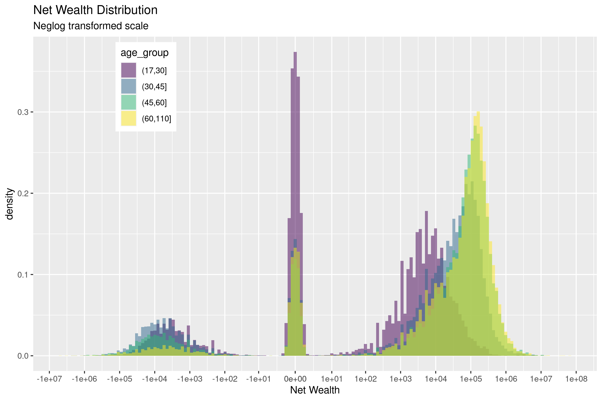

|             | At least one year | All Years | Total   |
| -----------:| -----------------:| ---------:| -------:|
| Survey Year |                   |           |         |
|   2011      | 9,939             | 11,615    | 21,554  |
|   2013      | 10,646            | 11,615    | 22,261  |
|   2015      | 9,860             | 11,615    | 21,475  |
|   2017      | 15,205            | 11,615    | 26,820  |
|   2019      | 14,306            | 11,615    | 25,921  |
|             |                   |           |         |
|   Total     | 59,956            | 58,075    | 118,031 |

Table: Sample Size

## Other tables 

.. link to other tables 

## Wealth distribution {.allowframebreaks}

## Correlation between wealth and satisfaction with health {.allowframebreaks}

## Preliminary results {.allowframebreaks}

Pooled OLS: 

- y: life / health satisfaction (scale 0 - 10)
- wealth: net wealth (interpolated)
- controls: age, education, gender, marital status, legally hadicapped, 

- wealth has higher predictive power at higher age. 
- unexpected non-linearity for lowest decile at higher ages (it could be highly leveraged pushing it)

## Graphs {.allowframebreaks}

## Issues 

- The fixed effects (or random) estimation is not converging. I believe is due to the fact that 
that there is little variation within-indiviual, since the majority of my control variables 
are categorical and wealth percentile is very stable in this short time frame.

## Ideas 

- check if there is enough observations with a big drop (or increase) in wealth in this time period
- 