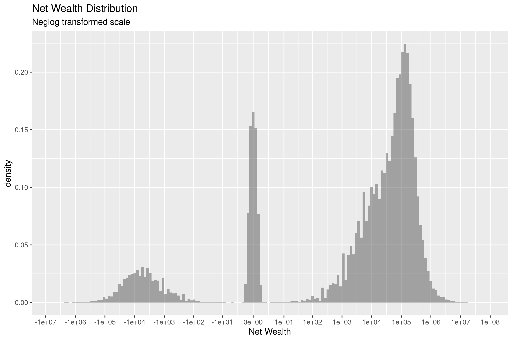
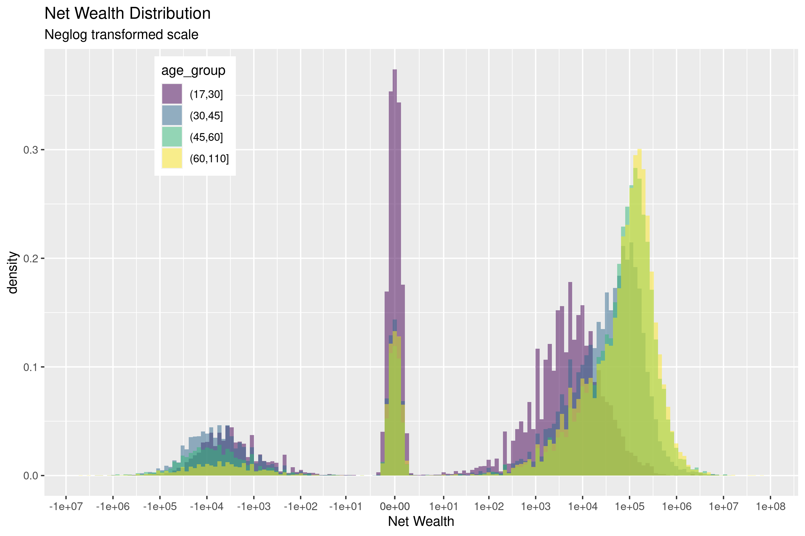
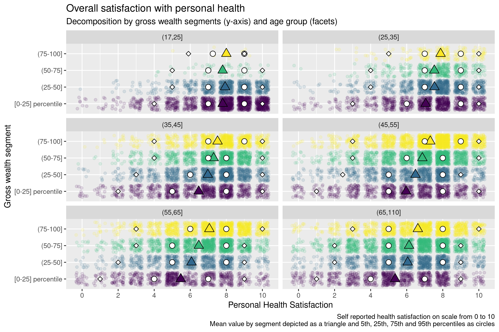
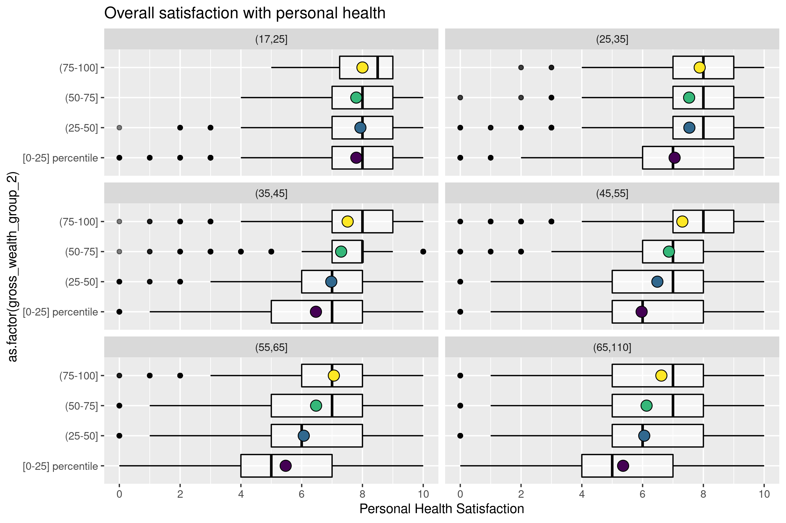
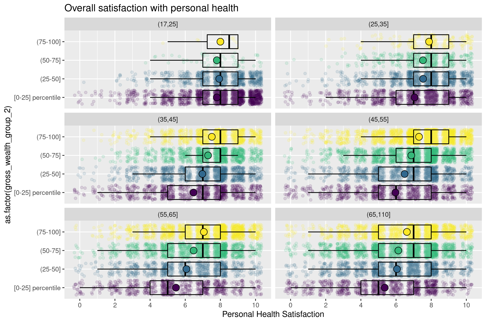

```{r setup, include=FALSE}
knitr::opts_chunk$set(echo = TRUE)
```


## Preview on Panel Structure

-   About 8.800 individuals if balancing sample for which health and wealth variables are present


## Wealth {.allowframebreaks}






## Interpolation of Wealth variables 

- Wealth variables not available for all (odd) years, so I imputed by linear interpolation for 
the missing years. 
- It is somewhat based on strong assumptions (linear development of wealth) but I believe 
better than other simple alternatives, such as last-observation-carried-forward (LOCF)

- some robustness checks would be necessary here, specially on dealing with missing data at the one 
or both "ends".

## Linear interpolation example 

```{r echo=FALSE}
y <- c(10, NA, 20, NA, NA, NA, 60, 120)
y2 <- c(NA, 15, NA, 30, 40, 50, NA, NA )
time <- 1:length(y)
plot(y ~ time, subset = !is.na(y))
points(y ~ time)
```

## Linear interpolation example 

```{r echo=FALSE}
y <- c(10, NA, 20, NA, NA, NA, 60, 120)
y2 <- c(NA, 15, NA, 30, 40, 50, NA, NA )
time <- 1:length(y)
plot(y ~ time, type="l", subset = !is.na(y))
points(y ~ time)
```

## Linear interpolation example

```{r echo=FALSE}
y <- c(10, NA, 20, NA, NA, NA, 60, 120)
y2 <- c(NA, 15, NA, 30, 40, 50, NA, NA )
time <- 1:length(y)
plot(y ~ time, type="l", subset = !is.na(y))
points(y ~ time)
points(y2 ~ time, col = "red")
```


## Questions

-   keep other samples as controls?
    - including sample that starts later? -> including more observations slightly less noisy (due to sample size) -\> could be better for inference (controls more similar to )

\scriptsize
```
    Survey |        to_keep
      Year |         0          1 |     Total
-----------+----------------------+----------
      2011 |    12,586      8,768 |    21,354 
      2013 |    10,597      8,768 |    19,365 
      2015 |     8,681      8,768 |    17,449 
      2017 |    18,024      8,803 |    26,827 
-----------+----------------------+----------
     Total |    66,798     35,107 |   101,905 
```

-   Wealth module for 2019?

-   Sample at risk for each disease?

- On the box-plots

## On the box-plots \| Original



## On the box plots \| Box Plot (incl. average)



## On the box plots \| Both together



## Outlook 

- gather control variables 
  - education, gender, labour-related, etc)

- run the regressions 