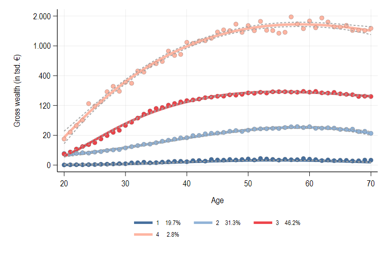
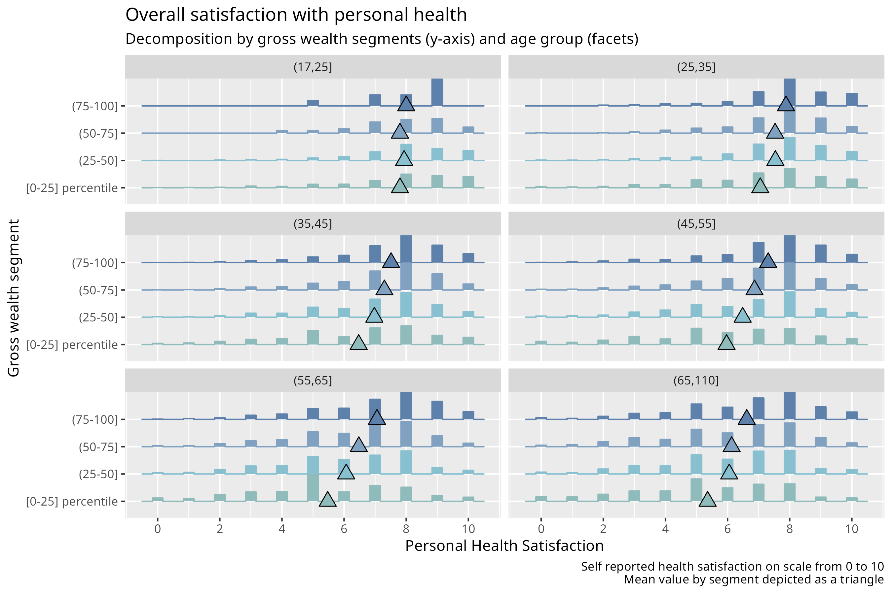
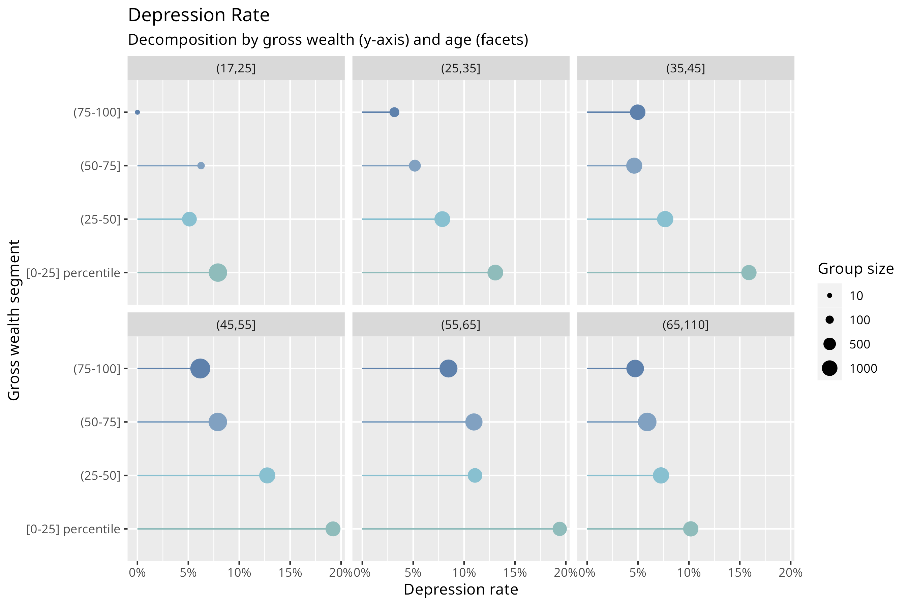

```{r setup, include=FALSE}
knitr::opts_chunk$set(echo = FALSE)
```


# Exploratory analysis of the health-wealth nexus over the life cycle in Germany (2002-2020)

## Thesis structure 

Due to how the two sets of health-related variables are posed in SOEP, the work is currently diveded in 
two parts:

- Part 1: Mental and Physical Scores derived from factor model over life cycle trajectory (2002--2020, bi-yearly)
- Part 2: Concrete health diagnoses over wealth distribution (2011--2019, bi-yearly)

## Defining the scope and research question

- What is the research question?

The positive correlation between health outcome and socioeconomic status has been well documented in the literature. 
But the exact nature of this relationship is still not deeply understood. One can easily think of reasons 
why it can be tricky to measure this relationship, specially when aiming at a causal inference: 

- Omitted variable (e.g. hard to measure genetic traits that affect both health and capacity of building wealth)
- Reverse causality or simultaneity ($H \rightarrow W$ and $W \rightarrow H$ concurrently) 
- Slow and long-term variation of both over the life cycle


## What can we do about it? 

- With SOEP data (from 2002--2020, which include the health module) we have the opportunity to 
investigate the wealth and health trajectory over a relatively long time span in a rich panel data setting.

- In this thesis, I don't aim to estimate any causal effect, but to elucidate **to what extent does
the health status between people differ according to their wealth level** and, in part 2, **which variables
are most predictive in terms of (poor) health outcomes**. 

- In Part 1 I focus on the difference between how mental and physical health correlates to wealth build-up. 

- In Part 2 the focus is on the rate of specific diagnoses (sleep disorder, back pain, etc) over the wealth
distribution.

## Why do we care? 

- Health inequality might be another source of disparity among people in a society. One can argue that 
a stark disparity is unfair and a society should use its economical and political means to reduce it.

- Poor health might have a triply negative effect on the life quality of an individual. 

    1) Directly impacting  their daily life in leisurely activities. 
    2) negatively impacting their ability to build wealth, that is,  have access to economic resources, by 
    diminishing their professional capacity and work output. 
    3) Being itself a  source of permanently higher costs of living. (This point is well remedied in Germany 
    with a universal health care system)

## Contribution to the literature?

<!-- (What do we know already and what is the delta in terms of knowledge your thesis will provide?) -->

- The SOEP data, which includes individual characteristics, health outcomes and wealth information provides
a unique perspective on the wealth-health nexus in a relatively long time frame. 

Open secondary hypotheses: 

- Differential impact of income variation on health over the wealth distribution?
- Differential impact of unemployment on health over the wealth distribution?
- Suggestions? 


# Part 1: Long Run: Mental and physical health scores, 2002--2020) 

## Methods of mental and physical health scores

1. Generate mental and physical health scores of SOEP Version of SF-12v2 Questions. 
2. Estimate longitudinal clusters of `wealth` over `age`. 
    - Here: `traj` Stata package to conduct a four-groups longitudinal clusters of wealth build-up
3. Model with `gologit` the relationship of wealth longitudinal cluster ($W^{lc}$) and mental and physical health scores
   - `gologit` relaxes the parallel lines assumption of `ologit`.
   
In a simplified version of the model specification, it would look like the following:
<!-- a -->
$$
W^{lc}_{it} = \alpha_0 +
\alpha_1 mcs_{it} + \alpha_2 pcs_{it} +
\alpha_1 mcs^{var}_{i} + \alpha_2 pcs^{var}_{i}   
+ \bm{\beta X_{it}} + \epsilon_{it}
$$

- $mcs_i^{var}$ and $pcs_i^{var}$ are a measure of variability of each score per individual


# Preliminary results: Factor model


## Overview of mental and physical health variables (I) 

\centering{width=80%}\

## Overview of mental and physical health variables (II)

\centering{width=80%}\


## Factor Loadings (I)

::: columns
:::: column

::::
:::: column

:::: 
:::

## Scores bi-dimensional density (I)


## Factor Loadings: Main points


1. Clusters are well defined and can be interpreted as physical and mental scores based on the underlaying questions.
<!-- 1. Rotating the makes the structure simpler, with clusters more strongly loaded onto unique factors -->
1. Allowing for oblique rotation increases the discrimination between clusters and their factors.
1. Vitality (`vt`) is not strongly loaded to any factor. Some practitioners would suggest dropping weakly loaded variables.
1. Variables of same category are indeed very close in the factor space, indicating respondents are indeed 
answering "similar" questions.

# Longitudinal clustering

## Preliminary results: Longitudinal clustering I



## Preliminary results: Longitudinal clustering II


## Preliminary results: Longitudinal clustering III

Table of descriptive statistics

\scalebox{0.5}{%
    \renewenvironment{table}[1][]{\ignorespaces}{\unskip}%
    \input{/home/avila/devel/WealthAndHealth/output/tables/desc/tab_desc.tex}
    \unskip
}

## Longitudinal clustering: Main points 

- The number of clusters is defined by the user
- The clusters are relatively well separated
    - 1: about 20% of sample does not build wealth at all
    - 2: about 31% builds a little wealth
    - 3: nearly half of sample builds considerable wealth
    - 4: small group (about 3%) that gets to be millionaires


# Preliminary generalized results of ordered logit model

## Mental scores coefficients

\tiny\input{/home/avila/devel/WealthAndHealth/output/tables/mod/tab_mod_mcs_mod.tex}

- Model 1: 17 <= age <= 35 (youth), 
- Model 2: 36 <= age <= 55 (prime working age), 
- Model 3: 56 <= age <= 75 (seniors)
- Same interpretation as ordered logit (ologit) estimation, but relaxing parallel lines assumption. That is, 
the effect is not assumed constant over all categories of the dependent variable, but can vary for each
(increasing) category.

## Physical scores coefficients

\tiny\input{/home/avila/devel/WealthAndHealth/output/tables/mod/tab_mod_pcs_mod.tex}

- Model 1: 17 <= age <= 35 (youth), 
- Model 2: 36 <= age <= 55 (prime working age), 
- Model 3: 56 <= age <= 75 (seniors)


## Main points 

- **Variation of Mental score (MCS)** more impactful than MCS itself.
- **Variation of Physical score (PCS)** not as relevant as variation of MCS.
- Physical component more important in **senior** population, as expected.
- Variation of MCS display same relevance over the three age groups.
- Among youth, PCS shows stronger correlation in wealthier (gr. 1,2,3 vs 4).
- **MCS** itself only (moderately) significant among wealthier (gr. 1,2,3 vs 4) and older individuals (models 2 and 3).


# Part 2: Random Forests health outcomes classification model, 2011--2019. 

## Motivation I



## Motivation II



## Motivation III


## Methods 

- From 2011 to 2019, SOEP also include a set of questions targeting specific health conditions, formulated as
"Have you ever been diagnosed with *x*?". The conditions are diabetes, heart issues, high blood pressure, sleep disorder, etc. 

- In this part, I aim to run a random forest classifier on each health condition and conduct a variable 
importance estimation. I also compare the model against a baseline logit estimation.


## This section still needs some working:

- focus on a fewer, more relevant health conditions.
- which covariates should be included in the model? (e.g. HH income?)
- Interpretability of tools such as **ALE plots** (Accumulated local effects) and **SHAP values**.


# Preliminary results of part 2

## A few graphs

### A) Single decision tree

##


## A few graphs

### B) Variable importance and ROC curve of selected variables

## 


## 


[link to Random Forest results and ALE plot issues](../quickpres/RF_scope/Wealth and health.html#61_ALE_plots:_Age)


# Current Issues with ALE plots


## Current Issues with ALE plots


- ALE plots depicts expected results for `age` and `education`, but not for `wealth`. 


## ALE plots: selected health diagnoses on age

::: columns
:::: column


::::
:::: column


:::: 
:::

## ALE plots: selected health diagnoses on education

::: columns
:::: column


::::
:::: column


:::: 
:::


## ALE plots: selected health diagnoses on gross wealth

::: columns
:::: column


::::
:::: column


:::: 
:::


# Thank you
